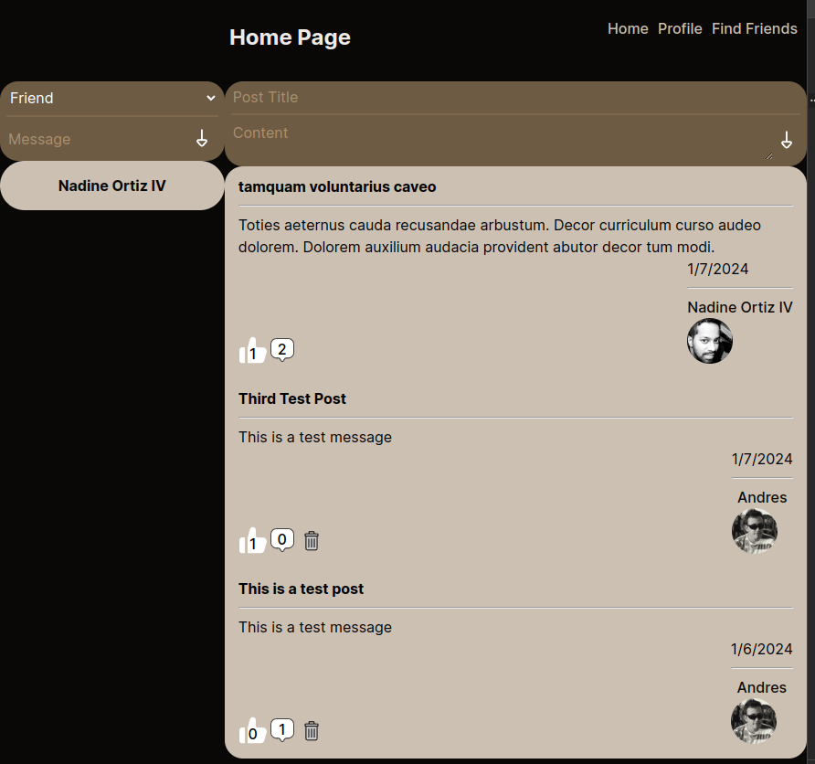
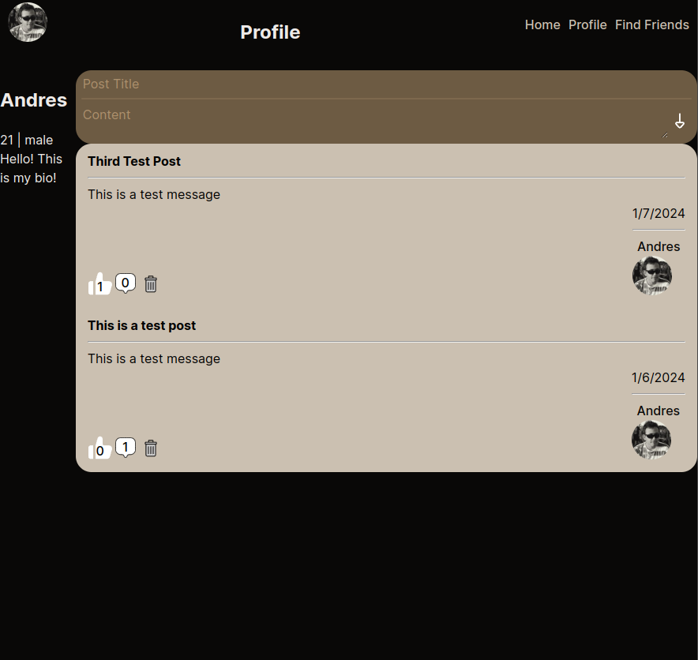
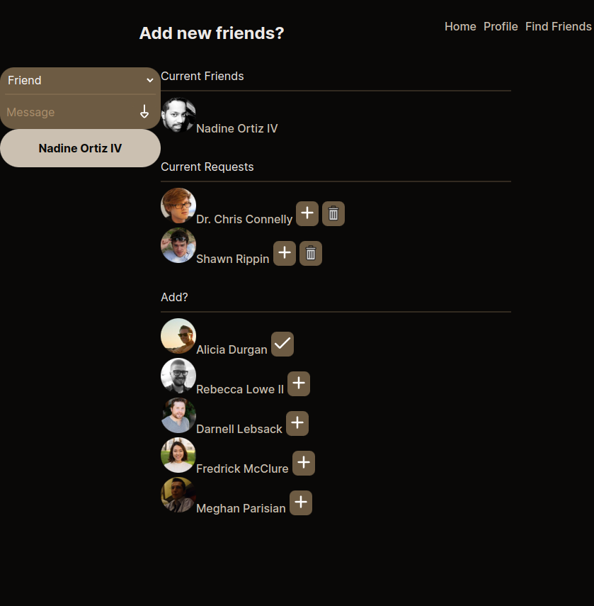

# Serene Book

The Odin Project: OdinBook

Test User:

- email: user@gmail.com
- password: password

## Description

This project was meant as practice for creating full stack apps. This app is a copy of a social media app, similar to facebook or twitter. It allows you to create an account, send a message to other users privately, and share posts with friends.

## Project Overview

### Tech stack

       

This uses React in the frontend, with an express and node backend. The database being used is a MongoDB database, being connected with Mongoose. Bcryptjs is also being used in conjunction with JWT tokens to provide authentication to users when they log in.

### Core Features

- Users profiles: Add user information to share with friends.
- Posts: Enable users to create, publish, and interact with posts.
- Friends: Implement the ability for users to follow others.
- Likes: Allow users to express interest in posts by liking them.
- Messaging: Allow users to message friends.

### Authentication

Authentication mechanisms being used include JWT and BcryptJS. Tokens are sent back and forth and required constantly for further security.

### Pages

The home page had functionality for messaging and posting. It allows you to create your own posts, manage your own posts, and interact with others posts, such as commenting and liking. It also allows for messaging new friends or open chats with old friends.

The profile page allows for you to see your own profile details and posts. Here you are also allowed to make your own posts and interact with your own posts.

The friends page allows you to manage your current friends, by managing friend requests, sending new requests, and seeing your current friends.

## Project Scope

### Backend Emphasis

- Prioritize backend functionalities and data management.
- Frontend and styling efforts are flexible and secondary in importance as this project was meant to learn express, nodejs, and mongoDB.
